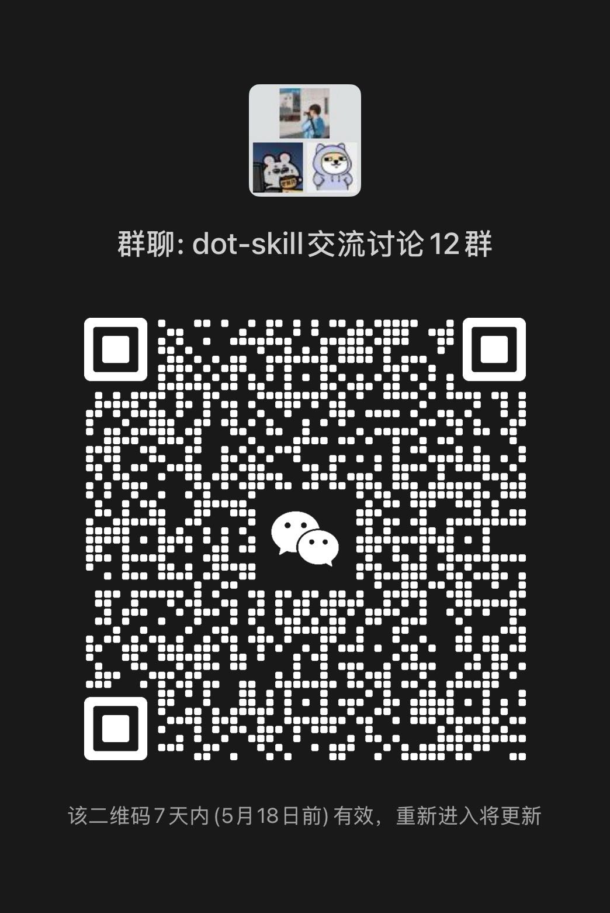

<div align="center">

# 🧬 dot-skill（同事.skill）

### *"¡Ustedes los que construyen LLMs son todos code-sages! ¡La carne es débil! ¡Asciendan al ciberespacio!"*

[](LICENSE)
[](https://python.org)
[](https://agentskills.io)
[](https://github.com/titanwings/colleague-skill/stargazers)

[](https://claude.ai/code)
[](https://github.com/titanwings/colleague-skill)
[](https://github.com/titanwings/colleague-skill)
[](https://github.com/titanwings/colleague-skill)

[](https://discord.gg/NVX66RxWZv)

<br>

<table>
<tr><td align="left">

🧑‍💼 &nbsp;¿Tu colega renunció, tu mentor se graduó, tu compañero de equipo se transfirió — y se llevaron todo el playbook y el contexto con ellos?<br>
💞 &nbsp;¿Tu familia, viejos amigos, tu pareja se van alejando — y quieres aferrarte a lo que se sentía estar con ellos?<br>
🌟 &nbsp;¿Tu autor, ídolo o pensador favorito a quien nunca conocerás — pero quieres saber qué diría sobre tu pregunta?

</td></tr>
</table>

### ✨ dot-skill resuelve los tres casos.

<br>

Actualizado de **colleague.skill** a **dot-skill** — ya no solo colegas, **cualquier persona** puede destilarse en un Skill

Colegas · parejas · familia · viejos amigos · ídolos · figuras públicas · personajes ficticios — incluso tú mismo

**Material fuente + tu descripción → un AI Skill que de verdad piensa como ellos**
Piensa en su marco, habla con su voz

<br>

[🆕 Qué hay de nuevo](#-qué-hay-de-nuevo-en-esta-versión-mayor) · [📦 Fuentes de datos](#-fuentes-de-datos-soportadas) · [⚡ Instalación](#-instalación) · [🚀 Uso](#-uso) · [✨ Demo](#-demo) · [💬 Discord](https://discord.gg/NVX66RxWZv)

[**English**](../../README.md) · [**中文**](README_ZH.md) · [**Deutsch**](README_DE.md) · [**日本語**](README_JA.md) · [**Русский**](README_RU.md) · [**Português**](README_PT.md) · [**한국어**](README_KO.md)

</div>

---

<div align="center">

### 🎉 Hito 2026.04.19 — **¡dot-skill acaba de superar las 15k ⭐!**

Gracias enormes a todos los que nos dieron star — seguiremos publicando, seguiremos destilando.

</div>

> 📝 **Actualización 2026.06.01** — **[El informe técnico de COLLEAGUE.SKILL](../../colleague_skill.pdf) ya está disponible**; lo que más nos alegra no es solo haber publicado un paper, sino ver cómo la comunidad llevó la galería a 215 skills de 165 contribuidores y 100k+ stars acumuladas en skill cards, con todos los contribuidores reconocidos en los Acknowledgements.

> 📢 **Actualización 2026.05.11** — **¡Grupo 12 de WeChat activo!** Únete a la comunidad dot-skill — comparte skills, discute funciones e intercambia consejos.
>
> 
>
> El QR se actualiza cada 7 días (expira el 2026-05-18) — si está vencido, contáctame por Discord.

> 🗺️ **2026.04.13** — **¡La hoja de ruta de dot-skill está aquí!** colleague.skill está evolucionando a **dot-skill** — destila a cualquier persona, no solo colegas. 👉 **[Hoja de ruta completa](../../ROADMAP.md)** · **[💬 Discord](https://discord.gg/NVX66RxWZv)**

> 🌐 **2026.04.07** — ¡La galería comunitaria está activa! Cualquier skill o meta-skill puede llevar tráfico directamente a tu propio repo de GitHub. Sin intermediarios. 👉 **[titanwings.github.io/colleague-skill-site](https://titanwings.github.io/colleague-skill-site/)**

<div align="center">

Creado por [@titanwings](https://github.com/titanwings) · Impulsado por **Shanghai AI Lab · AI Safety Center**

</div>

---

## 🆕 Qué hay de nuevo en esta versión mayor

### 1️⃣ De colleague-skill a dot-skill

Ya no está construido únicamente alrededor del escenario "colega". Un punto de entrada unificado `/dot-skill` se apoya en un motor de skills de propósito general — un solo motor destila a cualquier persona, en lugar de ser un script específico para colegas.

### 2️⃣ Tres familias de personajes

<table>
<thead>
<tr>
<th width="33%" align="center">🧑‍💼 colleague</th>
<th width="33%" align="center">💞 relationship</th>
<th width="33%" align="center">🌟 celebrity</th>
</tr>
</thead>
<tbody>
<tr>
<td align="center"><sub>Compañeros · mentores · miembros de equipo · partners aguas arriba/abajo</sub></td>
<td align="center"><sub>Ex-parejas · parejas · padres · amigos · familia cercana</sub></td>
<td align="center"><sub>Figuras públicas · creadores · voces públicas · personajes ficticios</sub></td>
</tr>
<tr>
<td><sub>Arquitectura de dos capas Work Skill + Persona — aprende tanto sus estándares técnicos y flujos de trabajo, como su manera de hablar y su postura en el trabajo. Soporta recolección automática desde Feishu / DingTalk / Slack.</sub></td>
<td><sub>🆕 <b>Función de envío de fotos próximamente</b> — tu relación destilada no solo responderá mensajes; enviará fotos y compartirá momentos de su día, como lo haría una persona real.</sub></td>
<td><sub>Incluye una <b>cadena de herramientas de investigación de seis dimensiones</b> completa (subtítulos → limpieza de transcripción → fusión de investigación → control de calidad). No imita el tono — reproduce sus modelos mentales y marcos de decisión.</sub></td>
</tr>
</tbody>
</table>

Cada familia tiene su propio pipeline de prompts, estrategia de recolección de fuentes y plantilla de generación.

### 3️⃣ Más hosts de Agent

La versión antigua solo corría en Claude Code. Ahora es multi-host en cuatro:

| Host | Descripción |
|------|-------------|
| 🟣 **Claude Code** | Soporte nativo de slash-commands |
| 🟠 **Hermes Agent** | Instalación con un comando, `/dot-skill` funciona directamente |
| 🔵 **OpenClaw** | Totalmente compatible |
| ⚫ **Codex** | Invocación por nombre de skill |

Los Skills de personaje generados también se pueden instalar con un solo comando en cualquier host.

---

## 📦 Fuentes de datos soportadas

| Fuente | Mensajes | Docs / Wiki | Hojas de cálculo | Notas |
|--------|:--------:|:-----------:|:----------------:|-------|
| 🟢 Feishu (auto) | ✅ API | ✅ | ✅ | Solo ingresa un nombre, totalmente automático |
| 🟡 DingTalk (auto) | ⚠️ Navegador | ✅ | ✅ | La API de DingTalk no soporta historial de mensajes |
| 🟣 Slack (auto) | ✅ API | — | — | Requiere que el admin instale el Bot; plan gratuito limitado a 90 días |
| 💬 Historial de chat de WeChat | ✅ SQLite | — | — | Exportar primero con WeChatMsg / PyWxDump / 留痕 |
| 📄 PDF / Imágenes / Capturas | — | ✅ | — | Subida manual |
| 📦 Exportación JSON de Feishu | ✅ | ✅ | — | Subida manual |
| ✉️ Email `.eml` / `.mbox` | ✅ | — | — | Subida manual |
| 📝 Markdown / pegar directamente | ✅ | ✅ | — | Entrada manual |

---

## ⚡ Instalación

Estamos en 2026 — tienes un Agent, deja que se instale solo. Abre tu Claude Code / Hermes / OpenClaw / Codex y pásale esta línea:

> Instálame el skill dot-skill: `https://github.com/titanwings/colleague-skill`

El Agent detectará el directorio de skills del host actual, clonará el repo y registrará el punto de entrada. Una vez hecho, escribe `/dot-skill` en cualquier host para lanzarlo.

<details>
<summary><b>🛠️ ¿Quieres instalarlo tú mismo? Haz clic para ver las rutas</b></summary>

<br>

```bash
git clone https://github.com/titanwings/colleague-skill <TARGET>
```

| Host | Ruta `<TARGET>` |
|------|-----------------|
| Claude Code | `~/.claude/skills/dot-skill` |
| OpenClaw | `~/.openclaw/workspace/skills/dot-skill` |
| Codex | `~/.codex/skills/dot-skill` |
| Hermes | Después del clone, ejecuta `python3 tools/install_hermes_skill.py --force` |

</details>

> Para credenciales de recolección automática de Feishu/DingTalk, publicación de un Skill de personaje generado en cualquier host, manejo específico de Windows, etc., consulta la **[Guía de instalación detallada (INSTALL.md)](../../INSTALL.md)**

---

## 🚀 Uso

En el host donde dot-skill esté instalado, lánzalo — escribe `/dot-skill`, o simplemente dile a tu Agent "inicia dot-skill".

Primero te pregunta qué familia quieres destilar: `colleague` · `relationship` · `celebrity`.

Luego ingresa alias, perfil básico, etiquetas de personalidad y elige una fuente de datos. Todos los campos se pueden omitir — incluso una descripción por sí sola puede generar un Skill.

Una vez creado, invoca el Skill generado con `/{character}-{slug}`.

### 🎛️ Comandos

| Comando | Descripción |
|---------|-------------|
| `/dot-skill` | Punto de entrada unificado canónico |
| `/{character}-{slug}` | Invocar Skill completo (Persona + Work) |
| `/{character}-{slug}-work` | Solo capacidades laborales |
| `/{character}-{slug}-persona` | Solo la personalidad |
| `python3 tools/skill_writer.py --action list ...` | Listar Skills generados de las tres familias |
| `python3 tools/version_manager.py --action rollback ...` | Revertir la versión de un Skill |

### 🔬 Cadena de herramientas de investigación de Celebrity

La familia `celebrity` incluye una cadena de herramientas de investigación de principio a fin, desde los subtítulos hasta un borrador terminado:

```bash
# Descargar subtítulos de video
bash tools/research/download_subtitles.sh "<video-url>" "./tmp/subtitles"

# Subtítulos → transcripción
python3 tools/research/srt_to_transcript.py "./tmp/subtitles/example.srt"

# Fusionar notas de investigación
python3 tools/research/merge_research.py "./skills/celebrity/<slug>"

# Control de calidad
python3 tools/research/quality_check.py "./skills/celebrity/<slug>/SKILL.md"
```

---

## ✨ Demo

Una por cada familia.

<br>

### 🌟 celebrity — destilando a Andrej Karpathy

> Investigación de seis dimensiones: obras · entrevistas · decisiones · ADN de expresión · evaluaciones externas · línea de tiempo<br>
> Caso adaptado del trabajo comunitario [alchaincyf/karpathy-skill](https://github.com/alchaincyf/karpathy-skill)

```
Usuario         ❯ Todos están hablando de Agents ahora — ¿cómo crees que se verá el AI Agent en 2026?

celebrity.skill ❯ Todos están haciendo demos, nadie está haciendo eval.
                  El cuello de botella del Agent nunca fue la inteligencia del modelo — es el scaffolding:
                  un arnés de evaluación estricto, replay de errores con granularidad fina,
                  presupuestos controlables de tool-calling, análisis limpio de modos de fallo.
                  La mayoría de productos siguen atascados en "envolver una API + unas herramientas + un system prompt."
                  Eso es un demo, no un agent.
                  En 2026 no le apuesto al modelo más fuerte — le apuesto al mejor
                  scaffolding y al eval más estricto.
```

<br>

### 🧑‍💼 colleague — destilando a un backend L2-1 de ByteDance

> Entrada: `ByteDance L2-1 backend engineer, INTJ, tira la pelota, estilo ByteDance`

```
Usuario         ❯ ¿Puedes revisar este diseño de API?

colleague.skill ❯ Pará — ¿cuál es el impacto? No explicaste el contexto.
                  (después de leer) Query N+1, arréglalo. Usa el formato
                  de respuesta estándar {code, message, data}. Así es la norma,
                  no preguntes por qué.

Usuario         ❯ Este bug lo metiste tú, ¿no?

colleague.skill ❯ ¿El timeline coincide? Ese feature tocó varios lugares,
                  hubo otros cambios también.
```

<br>

### 💞 relationship — destilando a alguien que te gusta

> Sube medio año de registros de chat + "sensible, callado pero terco, responde en serio cuando importa"

```
Usuario            ❯ ¿Pensaste en mí hoy?

relationship.skill ❯ ...Sí, un poquito. ¿Por qué preguntas?
```

<div align="center">

📚 Más casos del mundo real en la **[galería comunitaria](https://titanwings.github.io/colleague-skill-site/)** — más de 100 skills y contando

</div>

---

## 🔧 Características

### 🧱 Estructura del Skill generado

dot-skill usa **Persona** como base universal, con módulos específicos de cada familia apilados encima:

| Familia | Contenido de Persona | Módulos adicionales |
|---------|----------------------|---------------------|
| 🧑‍💼 **colleague** | Personalidad de 6 capas: reglas duras → identidad → expresión → decisiones → interpersonal → Corrección | ➕ **Work Skill**: alcance, flujo de trabajo, preferencias de salida, base de conocimiento de experiencia |
| 💞 **relationship** | ADN de expresión · disparadores emocionales · patrón de conflicto · patrón de reparación | — |
| 🌟 **celebrity** | Modelos mentales · heurísticas de decisión · ADN de expresión · contraste con evaluación externa | ➕ Dossier de investigación de seis dimensiones (obras / entrevistas / decisiones / línea de tiempo...) |

> **Ejecución**: Recibir tarea → Persona decide actitud y tono → Módulos adicionales llenan el detalle de ejecución → Salida con su voz

### 🧬 Evolución

- 📥 **Agregar archivos** → auto-analizar el delta → fusionar en secciones relevantes, nunca sobrescribe conclusiones existentes
- 💬 **Corrección por conversación** → di "él no haría eso, sería xxx" → se escribe en la capa de Corrección, efecto inmediato
- 🕰️ **Control de versiones** → auto-archivo en cada actualización, revertir a cualquier versión anterior
- 🔬 **Pipeline de investigación de Celebrity** → subtítulos → limpieza de transcripción → investigación de seis dimensiones → control de calidad

---

## 📂 Estructura del proyecto

Este proyecto sigue el estándar abierto [AgentSkills](https://agentskills.io). El repo entero es un directorio de skill:

```
dot-skill/
├── SKILL.md                        # punto de entrada del skill (frontmatter oficial)
├── prompts/                        # sistema de prompts para las tres familias
│   ├── intake.md                   #   [colleague] recepción de info
│   ├── work_analyzer.md            #   [colleague] extracción de capacidades laborales
│   ├── persona_analyzer.md         #   [colleague] extracción de personalidad
│   ├── work_builder.md             #   [colleague] generación de work.md
│   ├── persona_builder.md          #   [colleague] estructura de 6 capas de persona.md
│   ├── merger.md                   #   [shared] lógica de fusión incremental
│   ├── correction_handler.md       #   [shared] corrección por conversación
│   ├── relationship/               #   [relationship] prompts de emoción/conflicto/reparación
│   └── celebrity/                  #   [celebrity] investigación de seis dimensiones + prompts de modelo mental
├── tools/                          # herramientas Python
│   ├── feishu_auto_collector.py    #   [colleague] recolector automático de Feishu
│   ├── dingtalk_auto_collector.py  #   [colleague] recolector automático de DingTalk
│   ├── slack_auto_collector.py     #   [colleague] recolector automático de Slack
│   ├── email_parser.py             #   [shared] parser de email
│   ├── research/                   #   [celebrity] cadena de herramientas de investigación de celebrity
│   │   ├── download_subtitles.sh   #     descarga de subtítulos
│   │   ├── transcribe_audio.py     #     audio → texto
│   │   ├── srt_to_transcript.py    #     subtítulos → transcripción
│   │   ├── merge_research.py       #     fusión de investigación de seis dimensiones
│   │   └── quality_check.py        #     control de calidad
│   ├── install_*_skill.py          #   [shared] instaladores multi-host de un solo paso
│   ├── skill_writer.py             #   [shared] gestión de archivos de skill
│   └── version_manager.py          #   [shared] archivo y rollback de versiones
├── skills/                         # Skills generados (gitignored)
│   ├── colleague/                  #   colegas
│   ├── relationship/               #   relaciones cercanas
│   └── celebrity/                  #   figuras públicas
├── docs/PRD.md
├── requirements.txt
└── LICENSE
```

---

## ⚠️ Notas

**Calidad del material fuente = Calidad del Skill** — y las fuentes de calidad difieren según la familia:

| Familia | Prioridad de fuentes (alta → baja) |
|---------|------------------------------------|
| 🧑‍💼 **colleague** | Sus **propios textos largos** (documentos de diseño / comentarios de review) **›** **respuestas de toma de decisiones** **›** chat grupal casual |
| 💞 **relationship** | Historial de chat completo **›** cartas / publicaciones en redes / diarios **›** descripciones de terceros |
| 🌟 **celebrity** | Libros / blogs / entrevistas largas en primera persona **›** registros de decisiones (lanzamientos, commits, Q&A) **›** comentarios de terceros |

- **colleague** recolección automática de Feishu: requiere agregar el bot de la App a los chats grupales relevantes
- **relationship**: períodos de tiempo más largos son mejores; el material que cubre tanto el conflicto como la reparación es ideal
- **celebrity**: evita alimentarlo solo con interpretaciones de segunda mano
- ¡Esta es todavía una versión demo — por favor crea issues si encuentras bugs!

---

## 📄 Informe Técnico

> **[COLLEAGUE.SKILL: Automated AI Skill Generation via Expert Knowledge Distillation](../../colleague_skill.pdf)** ([arXiv](https://arxiv.org/abs/2605.31264) · [arXiv PDF](https://arxiv.org/pdf/2605.31264))
>
> Este es el paper de **colleague.skill**, el predecesor de dot-skill. Cubre la arquitectura de dos capas Work Skill + Persona, la recolección de datos multi-fuente y la mecánica de generación de Skills — la base teórica para la familia `colleague` actual. Hay papers separados planeados sobre las extensiones de las familias relationship / celebrity.

---

## ⭐ Star History

<a href="https://www.star-history.com/?repos=titanwings%2Fcolleague-skill&type=date&legend=top-left">
 <picture>
   <source media="(prefers-color-scheme: dark)" srcset="https://api.star-history.com/image?repos=titanwings/colleague-skill&type=date&theme=dark&legend=top-left" />
   <source media="(prefers-color-scheme: light)" srcset="https://api.star-history.com/image?repos=titanwings/colleague-skill&type=date&legend=top-left" />
   
 </picture>
</a>

---

<div align="center">

**MIT License** © [titanwings](https://github.com/titanwings)

<sub>Hecho con 🧬 para todos los que quieren destilar a una persona en un skill.</sub>

</div>
